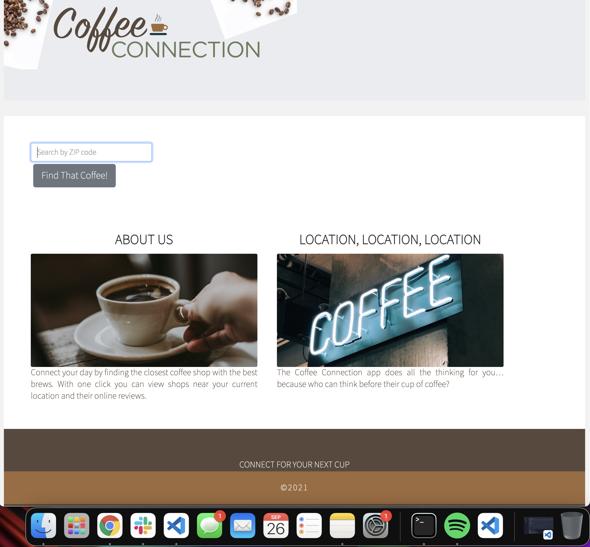
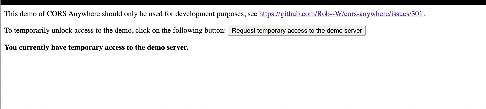

# Coffee Connection 
A small and useful app to help you git your coffee fix
<!-- TABLE OF CONTENTS -->
## Table of Contents
* [About the Project](#about-the-project)
* [Motivation](#motivation)
* [User Story](#user-story)
* [Built With](#built-with)
* [Usage](#usage)
* [Contact](#contact)

<!-- ABOUT THE PROJECT -->
## About The Project

The “key” to success starts with your morning routine. We all struggle to stay connected during our busy day.  Most of us are rushing to work, the gym, shuffling kids to school and extracurricular events. Life is hard, it gets in the way. We want to help you stay Connected though making a Coffee Connection!  According to the National Coffee Association, USA, 7 out of 10 Americans drink coffee every week and 62% drink coffee daily. Coffee Connection wants to help you find the best cup of brew closest to your location.  Our app will allow you to search for a Coffee Connection near you. As a user you will be able to type in your zip code and view area coffee shops.  We know not all coffee shops are the same. Maybe you’re into pour overs, tasting flights or just great organic fair trade beans French pressed to perfection. We’ll provide you with customer reviews for each location, powered by Yelp.  One promise we make is this app is The Most Magical, Life-Changing App You'll Ever Use.

## Motivations for the App
Motivation: Create a site to connect coffee lovers to local coffee shops! Our group is composed of 4 working adults who were crazy enough to take on a 6 month coding bootcamp in the evening. What is always on our mind, coffee and sleep! This helped motivate our group to design an app to help users  connect to local coffee shops with the best reviews.

## User Story
As a user I want an app to help me find a coffee shop in my city. When I click on the coffee shop, I want to view the reviews associated with that location.

## Built With
* HTML
* JavaScript
* CSS
* [Bootstrap](https://getbootstrap.com)
* [JQuery](https://jquery.com)

<!-- USAGE EXAMPLES -->
## Usage

When the user first opens the website and performs a search, they will need to click on the link in the console (https://cors-anywhere.herokuapp.com/corsdemo) and request temp access.

In addition, we used an environmental file "env.js" to store our keys locally. Anyone pulling the code would need to gain the env.js file.

<!-- CONTACT -->
## Contact
Project Link: [https://doctormuch.github.io/fs-joe-java-journey/](https://doctormuch.github.io/fs-joe-java-journey/)

Project Repository: [https://github.com/DoctorMuch/fs-joe-java-journey](https://github.com/DoctorMuch/fs-joe-java-journey)
